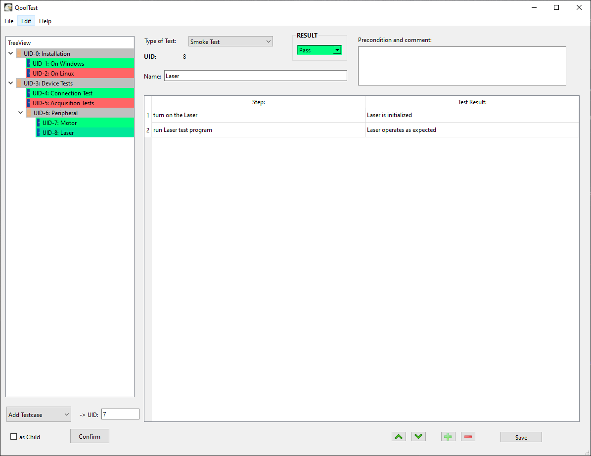

# QoolTest
---
This is a test management tool which allows user to create, modify and save test cases.

User has also the option to mark test cases with results, such as "Neutral", "Pass" and "Fail".

All test results could be cleaned up using "Edit"|"Clear Results".

# Preview
